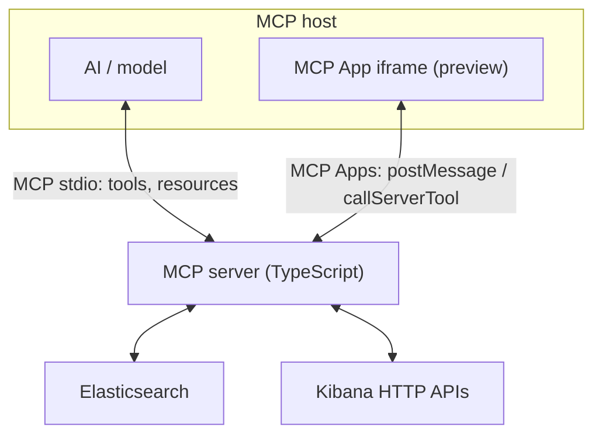
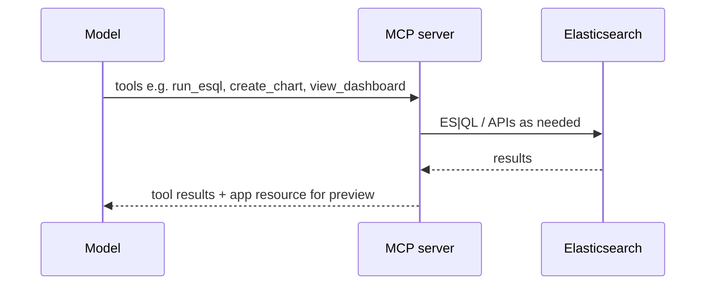
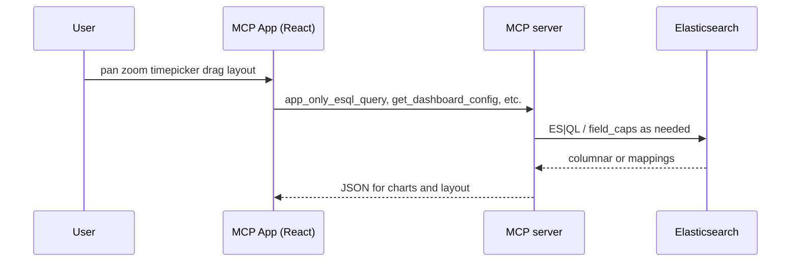
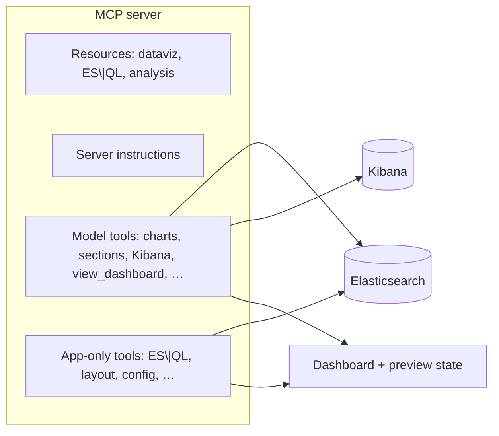
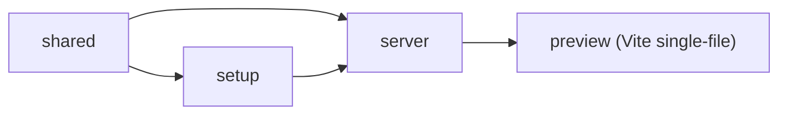

# Architecture

This document describes how the **example-mcp-dashbuilder** MCP app fits together: processes, data flow, and how the monorepo builds. For user-facing setup, see [README.md](README.md). For day-to-day commands, see [AGENTS.md](AGENTS.md).

## 1. System context

The MCP **host** (Cursor, Claude Desktop, VS Code, etc.) spawns a single **MCP server** over **stdio**. The same server talks to **Elasticsearch** and **Kibana** (export/import) and, when the user opens the inline preview, serves an **MCP App** HTML bundle to the host. The app runs in a sandboxed iframe and does not call Elasticsearch directly; it reaches the server through the MCP Apps bridge (`callServerTool`).

**Boundaries**

- **Model-visible tools** — `create_chart`, `run_esql`, `view_dashboard`, etc. The model reads resources such as `dataviz://guidelines` and `esql://reference`.
- **App-only tools** — Registered with `visibility: ["app"]` so the model does not see them. The preview UI uses them for ES|QL execution, layout refresh, time-field detection, and other interactive behavior.
- **No local HTTP for the preview** — The iframe talks to the already-running MCP server process via the ext-apps client, not to a second web server you start manually.

## 2. End-to-end flows

### 2.1 Build or change a dashboard (model path)

The assistant drives dashboard state through the normal MCP tool interface. The server updates dashboard configuration (JSON files on disk; directory configurable via `DASHBOARDS_DIR`, defaulting under `preview/public/dashboards`), and, when `view_dashboard` runs, the host loads the MCP App resource and passes `dashboardId` for session isolation.

### 2.2 Interactive preview (MCP App path)

After the host embeds the bundle, the React app fetches data and layout by calling **app-only** tools. Those execute on the same server process, reuse ES clients, and read the same dashboard store the model tools update.

## 3. Server composition (logical)

The server process registers **resources** (markdown references), **server instructions** (model-facing workflow text), and **tools** (public + app-only). Export and import use Kibana’s HTTP APIs; data queries use ES|QL.

## 4. Monorepo and build order

The repository is an npm **workspace** monorepo. The production bundle depends on a strict build order: shared code first, then the setup CLI, the server, and finally the single-file **preview** HTML used as the MCP App.

| Workspace | Output role                                                               |
| --------- | ------------------------------------------------------------------------- |
| `shared`  | Shared types and utilities for other packages                             |
| `setup`   | Interactive `npm run setup` CLI (writes `.env`)                           |
| `server`  | stdio MCP server: tools, resources, Kibana export                         |
| `preview` | One HTML file embedded as the MCP App resource (`vite-plugin-singlefile`) |

`npm run build` at the root runs: `shared` → `setup` → `server` → `preview`. Continuous integration runs `format:check`, `lint`, `test`, `typecheck`, and `build` on the full tree; integration tests run from `server` against real Elasticsearch and Kibana in Docker (see [README.md](README.md#integration-tests)).

## 5. Session isolation

Multiple chat sessions can use different dashboards. Tool calls should carry a **`dashboardId`** when the product supports it so that concurrent conversations do not overwrite each other’s state. The exact threading is documented in server tool schemas and in the [README features](README.md#features) section.

## See also

- [README.md](README.md) — product overview, MCP config, release process
- [AGENTS.md](AGENTS.md) — contributor commands, style, testing rules
- [CONTRIBUTING.md](CONTRIBUTING.md) — PR and review expectations
