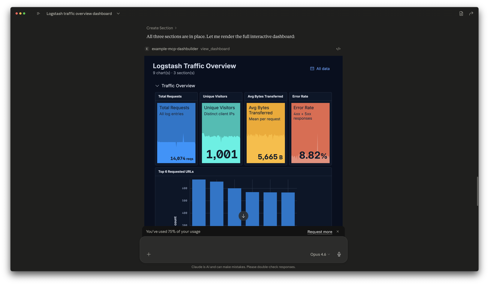

# example-mcp-dashbuilder

An MCP (Model Context Protocol) app that lets AI assistants build Kibana dashboards using ES|QL and Elastic Charts. Create visualizations through natural language, preview them live with Kibana's grid layout, and export directly to Kibana as real Lens dashboards.



_Screenshot from Claude Desktop: the MCP app renders the interactive dashboard inside the chat._

## What it does

```
You (in an MCP client) → "Build me an ecommerce analytics dashboard"
    ↓
AI explores your Elasticsearch data via ES|QL
    ↓
Creates charts (bar, line, pie, metric, heatmap) with Elastic Charts
    ↓
Interactive dashboard rendered inline in the chat (MCP Apps)
    ↓
One-click export to Kibana as Lens visualizations
```

## Features

- **Natural language dashboard creation** — describe what you want, the AI builds it
- **Deep data analysis** — open-ended exploration flow that runs aggregations, surfaces patterns, builds charts for key findings, and suggests drill-down queries (triggered by prompts like "analyze my X")
- **ES|QL powered** — all queries use ES|QL for data retrieval
- **Inline dashboard preview** — full interactive dashboard rendered directly in the chat via MCP Apps
- **Kibana grid layout** — same 48-column drag-and-drop grid as Kibana dashboards
- **Borealis theme** — matches Kibana's latest visual design
- **Collapsible sections** — organize panels into groups
- **Export to Kibana** — creates real Kibana dashboards with Lens visualizations
- **Import from Kibana** — import existing ES|QL-based Kibana dashboards for AI-assisted editing
- **Custom color themes** — apply custom palettes to charts, heatmaps, and metrics
- **Time picker** — filter data by time range with automatic time field detection
- **Multiple dashboards** — create, switch between, and manage multiple dashboards
- **Session isolation** — parallel chat conversations work on separate dashboards via `dashboardId` threading
- **Elastic Cloud support** — works with local Elasticsearch and Elastic Cloud (Cloud ID + API key)
- **Server instructions** — workflow, tips, and capabilities exposed to every MCP client via the `initialize` response
- **Dataviz best practices** — built-in guidelines for chart selection and dashboard composition
- **ES|QL reference** — built-in language reference for correct query syntax

## Architecture

For a structured walkthrough with Mermaid diagrams (system context, data flows, monorepo build order), see [ARCHITECTURE.md](ARCHITECTURE.md).

## Prerequisites

- Node.js 22+
- Elasticsearch (local or Elastic Cloud)
- Kibana (for export/import)
- An MCP client: [Cursor](https://cursor.com) (v2.6+ for MCP Apps inline preview), [Claude Desktop](https://claude.ai/download), [Claude Code](https://claude.ai/claude-code), or [VS Code Copilot](https://code.visualstudio.com/)

## Quick install

No need to clone the repo — pick the method that matches your MCP client.

**Claude Desktop:** Download the latest `.mcpb` file from [GitHub Releases](https://github.com/elastic/example-mcp-dashbuilder/releases) and double-click it. Claude Desktop will prompt you for your Elasticsearch credentials.

**Cursor / Claude Code / VS Code:** Point your MCP config at the release tarball — no clone, no npm install:

```json
{
  "mcpServers": {
    "example-mcp-dashbuilder": {
      "type": "stdio",
      "command": "npx",
      "args": [
        "https://github.com/elastic/example-mcp-dashbuilder/releases/latest/download/example-mcp-dashbuilder.tgz"
      ]
    }
  }
}
```

Set your Elasticsearch credentials as environment variables (`ES_NODE`, `ES_API_KEY` or `ES_USERNAME`/`ES_PASSWORD`, `KIBANA_URL`) or run `npm run setup` after cloning.

## Setup (from source)

### 1. Install dependencies

```bash
git clone https://github.com/elastic/example-mcp-dashbuilder.git
cd example-mcp-dashbuilder
npm install
```

This also auto-builds the MCP App (the inline dashboard preview).

### 2. Configure Elasticsearch connection

Run the setup wizard to configure your Elasticsearch and Kibana credentials:

```bash
npm run setup
```

The wizard supports both local and Elastic Cloud deployments:

- **Local:** Elasticsearch URL + username/password
- **Elastic Cloud:** Cloud ID + username/password or API key

Credentials are saved to a `.env` file (gitignored).

### 3. Configure your MCP client

No environment variables are needed if you ran `npm run setup` — credentials are loaded from `.env` automatically.

The repo includes a `start-server.sh` script that handles nvm/node path resolution automatically. This is the recommended way to configure the server.

**Cursor** (`.cursor/mcp.json`):

```json
{
  "mcpServers": {
    "example-mcp-dashbuilder": {
      "type": "stdio",
      "command": "./start-server.sh"
    }
  }
}
```

**Claude Code** (`.mcp.json` in project root — already included):

```json
{
  "mcpServers": {
    "example-mcp-dashbuilder": {
      "type": "stdio",
      "command": "./start-server.sh"
    }
  }
}
```

**Claude Desktop** (`claude_desktop_config.json` — found in `~/Library/Application Support/Claude/` on macOS or `%APPDATA%\Claude\` on Windows):

For the easiest experience, download the `.mcpb` file from [Releases](https://github.com/elastic/example-mcp-dashbuilder/releases). For manual setup from source:

```json
{
  "mcpServers": {
    "example-mcp-dashbuilder": {
      "command": "/absolute/path/to/example-mcp-dashbuilder/start-server.sh"
    }
  }
}
```

Note: Claude Desktop requires an absolute path.

### 4. Open the project in your MCP client

Open the `example-mcp-dashbuilder` folder in your MCP client. The MCP server will auto-connect. In Cursor, you should see it listed in Settings > MCP.

### Troubleshooting

- **`npx: command not found`** — Cursor/Claude Desktop may not inherit your shell PATH when launched from the dock. Either open your client from the terminal (e.g. `cursor .`) or use the `start-server.sh` script which loads nvm automatically.
- **`EPERM: operation not permitted`** — Claude Desktop's macOS sandbox blocks access to `~/Documents`. Move the repo to a non-protected location like `~/example-mcp-dashbuilder` or `/tmp`.
- **Wrong Node version** — The project requires Node 22+. If you use nvm, `start-server.sh` handles this. For manual config, use the full path to your Node binary: `/Users/you/.nvm/versions/node/v22.x.x/bin/node`.

## Usage

### Example prompts

**Quick start:**

> "Build me a dashboard from kibana_sample_data_ecommerce with revenue metrics, order trends, and category breakdowns"

**Detailed:**

> "Create a new dashboard called 'Flight Operations'. Show metrics for total flights, average delay, and cancellation rate. Add a bar chart of flights by carrier, a line chart of delays over time, and a pie chart of flight status distribution. Organize into sections."

**Exploratory:**

> "Explore the kibana_sample_data_logs index and build me the most insightful dashboard you can"

**Analysis:**

> "Analyze my logs data"

> "What's interesting in the ecommerce orders index?"

**Export / Import:**

> "Export the current dashboard to Kibana"

> "Import the Kibana dashboard at http://localhost:5601/app/dashboards#/view/abc-123"

**Multi-dashboard:**

> "List my dashboards" / "Switch to the ecommerce dashboard" / "Create a new dashboard called 'Log Analysis'"

### Available MCP tools

| Tool                    | Description                                         |
| ----------------------- | --------------------------------------------------- |
| `create_dashboard`      | Create a new dashboard                              |
| `list_dashboards`       | List all saved dashboards                           |
| `switch_dashboard`      | Switch to a different dashboard                     |
| `delete_dashboard`      | Delete a dashboard                                  |
| `run_esql`              | Execute ES\|QL queries                              |
| `list_indices`          | Discover available indices                          |
| `get_fields`            | Get field mappings for an index                     |
| `create_chart`          | Create bar, line, area, or pie charts               |
| `create_metric`         | Create metric/KPI panels with trend sparklines      |
| `create_heatmap`        | Create heatmap visualizations                       |
| `create_section`        | Create collapsible dashboard sections               |
| `move_panel_to_section` | Assign panels to sections                           |
| `remove_section`        | Remove a section                                    |
| `remove_chart`          | Remove a chart                                      |
| `set_dashboard_title`   | Set the dashboard title                             |
| `get_dashboard`         | Get the active dashboard configuration              |
| `clear_dashboard`       | Reset the active dashboard                          |
| `export_to_kibana`      | Export to Kibana as Lens visualizations             |
| `import_from_kibana`    | Import an existing Kibana dashboard (ES\|QL panels) |
| `view_dashboard`        | Display the full dashboard inline in the chat       |

### Available MCP resources

| Resource                | Description                                                                                   |
| ----------------------- | --------------------------------------------------------------------------------------------- |
| `dataviz://guidelines`  | Chart selection, dashboard composition, and anti-patterns                                     |
| `esql://reference`      | ES\|QL commands, functions, and visualization query patterns                                  |
| `analysis://guidelines` | Structured flow for open-ended analysis — trigger phrases, four-section response, drill-downs |

## Supported chart types

| Type    | Best for                       | Example                            |
| ------- | ------------------------------ | ---------------------------------- |
| Bar     | Comparing categories           | Revenue by product category        |
| Line    | Trends over time               | Daily order count                  |
| Area    | Volume over time               | Traffic over time                  |
| Pie     | Part-of-whole (max 6 slices)   | Orders by status                   |
| Metric  | Single KPI with optional trend | Total revenue with daily sparkline |
| Heatmap | Patterns across 2 dimensions   | Orders by day of week × hour       |

## HTTP transport

Start the server in HTTP mode:

```bash
npm run start -- --http
```

The server listens on `http://127.0.0.1:3001/mcp` by default. Override with environment variables:

```bash
HOST=127.0.0.1 PORT=3002 npm run start -- --http
```

## Inline dashboard preview (MCP Apps)

The `view_dashboard` tool renders the full interactive dashboard directly inside the chat using [MCP Apps](https://modelcontextprotocol.io/extensions/apps/overview).

**Client requirements:** Cursor v2.6+, Claude Desktop, Claude.ai, or VS Code Copilot.

## Export to Kibana

The export tool translates each panel to a Lens visualization:

| MCP Chart         | Kibana Lens Type |
| ----------------- | ---------------- |
| bar / line / area | XY Visualization |
| pie               | Partition (Pie)  |
| metric            | Metric           |
| heatmap           | Heatmap          |

Grid positions are preserved 1:1 (same 48-column system). ES|QL queries transfer directly. Time fields are auto-detected via field_caps so Kibana's time picker works immediately. Custom colors (series palettes, metric backgrounds, heatmap ramps) are preserved on export.

## Credits

- [Elastic Charts](https://elastic.github.io/elastic-charts) for visualization rendering
- [@elastic/esql](https://github.com/nicolo-ribaudo/elastic-esql-js) for ES|QL query parsing
- [kbn-grid-layout](https://github.com/elastic/kibana) for the dashboard grid (adapted from Kibana)
- [Model Context Protocol](https://modelcontextprotocol.io) for AI tool integration
- [MCP Apps](https://modelcontextprotocol.io/extensions/apps/overview) for inline UI rendering
- ES|QL reference docs adapted from Kibana's NL-to-ES|QL feature

## Licence

Licensed under [Elastic License 2.0](./LICENSE.txt).
